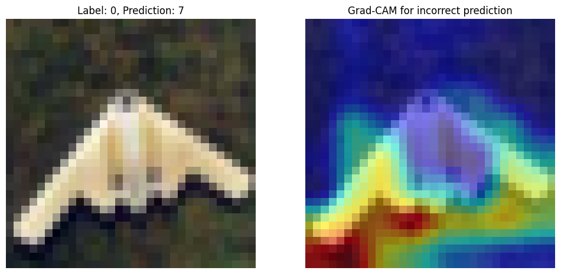
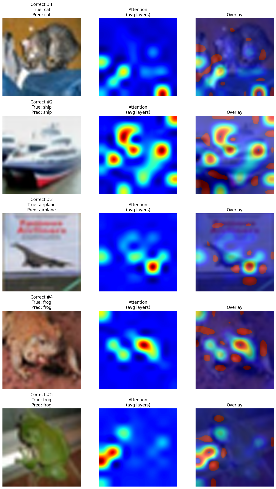

# CNN vs. Vision Transformers (ViT) on CIFAR-10 🧠


**Authors:** Jacob Maimon, Bar Naor  
**Course:** Deep Learning Applications (Assignment 3)

---

## 📌 Overview
This project performs a comprehensive comparative analysis between two dominant architectures in Computer Vision:
1.  **Convolutional Neural Networks (CNN):** A custom-built architecture trained from scratch.
2.  **Vision Transformers (ViT):** A full implementation of the Transformer architecture for image classification (Patch Embedding, Self-Attention).

Both models are trained on the **CIFAR-10** dataset using **PyTorch Lightning** for efficient training loops and **Weights & Biases (WandB)** for experiment tracking.

## 🏗️ Architectures

### 1. Custom CNN
A classic architecture featuring:
* 3 Convolutional Blocks (Conv2d + ReLU + MaxPool).
* Dropout Regularization (0.5).
* Fully Connected Layers for classification.

### 2. Vision Transformer (ViT)
Implemented from scratch to understand the mechanism:
* **Patch Embedding:** Splitting 32x32 images into 4x4 patches.
* **Transformer Encoder:** 8 layers of Multi-Head Self-Attention.
* **CLS Token:** Used for final classification.

## 🔍 Explainability (XAI)

One of the key goals of this project is to visualize **how** the models make decisions.

### CNN: Grad-CAM
We used **Gradient-weighted Class Activation Mapping (Grad-CAM)** to highlight the regions in the image that activated the final convolutional layers the most.


*(Figure 1: Grad-CAM heatmap overlay showing CNN focus regions)*

### ViT: Attention Maps
We extracted the **Self-Attention weights** from the last Transformer layer to visualize which patches the model attends to when classifying an object.


*(Figure 2: Attention Map showing ViT focus areas)*

## 🚀 How to Run

1.  **Clone the repository:**
    ```bash
    git clone [https://github.com/JacobMaimon13/ViT-vs-CNN-CIFAR10.git](https://github.com/JacobMaimon13/ViT-vs-CNN-CIFAR10.git)
    cd ViT-vs-CNN-CIFAR10
    ```

2.  **Install dependencies:**
    ```bash
    pip install -r requirements.txt
    ```

3.  **Train the models:**
    You can choose which model to train using the command line arguments:

    ```bash
    # Train the CNN
    python train.py --model cnn --epochs 10

    # Train the ViT
    python train.py --model vit --epochs 10
    ```

4.  **View Results:**
    * Check `outputs/figures/` for generated visualizations.
    * Check your WandB dashboard for loss/accuracy curves.

## 📂 Project Structure

```text
ViT-vs-CNN-CIFAR10/
├── src/
│   ├── models/             # CNN & ViT Implementations
│   ├── utils/              # Data Loaders & Interpretation logic
├── outputs/
│   ├── figures/            # Generated Explainability plots (GradCAM/Attention)
│   ├── models/             # Saved model checkpoints
├── train.py                # Main training script
└── requirements.txt        # Dependencies
